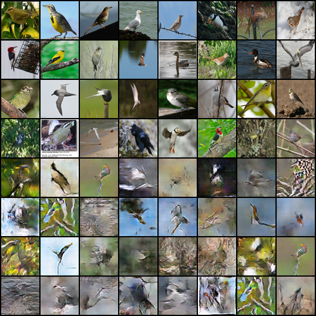
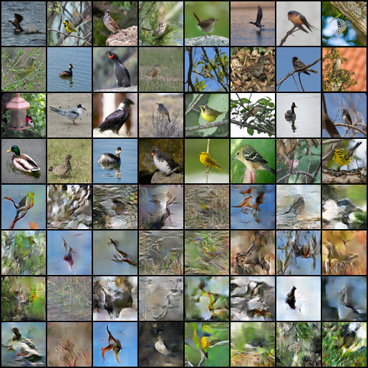

# Text-to-Image Synthesis Using GANs from Scratch

This repository contains a PyTorch implementation of a Text-to-Image Generative Adversarial Network (GAN). The model is designed to generate images from textual descriptions, leveraging a combination of text embeddings and noise vectors to produce realistic images. The project is particularly focused on generating bird images based on textual descriptions, using the CUB (Caltech-UCSD Birds-200-2011) dataset. The implementation of the project is influenced from [this](https://arxiv.org/abs/1605.05396) paper and built on top of my other [project](https://github.com/pavanpajjuri/GAN_from_scratch) where I implemented GAN from scratch


## Table of Contents

- [Overview](#overview)
- [Repository Structure](#repository-structure)
- [Prerequisites](#prerequisites)
- [Data Preparation](#data-preparation)
- [Training the Model](#training-the-model)
- [Evaluation](#evaluation)
- [Results](#results)
- [Future Work](#improvements-and-future-work)

---

## Overview

The goal of this project is to generate realistic images from textual descriptions of birds. The project is divided into three main parts:
1. **Data Conversion:** Converting the raw CUB dataset (including images, text descriptions, and precomputed embeddings) into a unified HDF5 file.
2. **Model Training:** Training a conditional GAN that learns to generate images given a text embedding. The GAN is implemented with custom Generator and Discriminator networks.
3. **Evaluation:** Generating images from new text inputs or using precomputed embeddings from the dataset and evaluate them using Inception Score (IS), FID and CLIP score

---

## Repository Structure

- **`convert_cub_to_hd5_script.py`**  
  Converts the CUB dataset files into an HDF5 file. This script reads the images, text captions, and precomputed embeddings (stored as Torch7 `.t7` files), organizes them into train/validation/test splits, and writes them into an HDF5 file.  

- **`Text_to_Image_GAN.py`**  
  Contains the implementation of the text-to-image GAN. It defines the Generator (`G`) and Discriminator (`D`) models, loads the custom dataset using `Text2ImageDataset` (from `data_util.py`), and trains the network using a combination of Binary Cross-Entropy (BCE), L1, and L2 losses.  

- **`data_util.py`**  
  Implements the `Text2ImageDataset` class, a PyTorch `Dataset` that loads the HDF5 file and provides the necessary data (images, text embeddings, and captions) for training.  

- **`eval.py`**  
  Provides an evaluation script that loads the trained generator model, obtains a text embedding using a pre-trained CLIP model (with a projection layer to match dimensions), and generates an image from an input text description.  

- **`eval_testdata.py`**  
  Evaluates the model by loading a precomputed embedding from the HDF5 dataset (using the test split) and generates an image based on that embedding.  

---

## Data Preparation

  The dataset ideally needs three things here. Raw Images, Text Descriptions of the images (bird in the images), vector embeddings of the text (which are pretrained). Now these are available in different datasources which we can download and unify them using the scripts I have modified them from ( `config.yaml`, `convert_cub_to_hd5_script.py`) this [reference](https://github.com/aelnouby/Text-to-Image-Synthesis). If any of this dataset official links (given below) are unavailable in future you can try [this](https://drive.google.com/drive/folders/1fVryE2GC96X57GC6LJfR0kWLvjpHQE-T?usp=drive_link) where I have stored the above original datasets.

1. **Download the CUB Dataset:**  
   - Download the CUB birds dataset. The CUB-200-2011 dataset is widely used in many reasearch papers which can be found [here](https://data.caltech.edu/records/65de6-vp158)
   - Download the cub_icml dataset which contains the train,val, test splits and text descriptions from [here](https://drive.google.com/file/d/0B0ywwgffWnLLLUc2WHYzM0Q2eWc/view?resourcekey=0-z04QWSQJKUaPaZoy8NarOQ)
   - Download the cvpr_2016 dataset that contains the numerical embeddings of the text from a pretrained model from [here](https://drive.google.com/file/d/0B0ywwgffWnLLZW9uVHNjb2JmNlE/view?resourcekey=0-8y2UVmBHAlG26HafWYNoFQ) which is referenced from [this](https://github.com/reedscot/icml2016) project
    

3. **Configuration:**  
   Create or update the `config.yaml` file with the paths to the following:
   - `birds_images_path`: Directory containing the bird images.
   - `birds_embedding_path`: Directory with the precomputed text embeddings (`.t7` files).
   - `birds_text_path`: Directory with text description files.
   - `birds_dataset_path`: Output path for the generated HDF5 file.
   - Paths for the train, validation, and test split lists.

4. **Convert Data to HDF5:**  
   Run the conversion script to generate the HDF5 file:
   ```bash
   python convert_cub_to_hd5_script.py
   ```
   This script reads each class from the embeddings directory, assigns it to the appropriate split (train, valid, test), randomly selects 5 captions per image, and writes all data into the HDF5 file.


I have done all this process and extracted the birds.hdf5 file which can found [here](https://drive.google.com/file/d/1Hn9hW7ivOfCOCztVBIiLEq2Fy8JkmHAQ/view?usp=drive_link)

## Prerequisites

- **Python 3.6+**
- **PyTorch** and **torchvision**
- **h5py**
- **PyYAML**
- **NumPy**
- **Matplotlib**
- **Transformers** (for BERT-based text embeddings)
- **Pillow** (PIL)
- Other dependencies as required by your environment (e.g., for GPU support via CUDA)

Install dependencies using pip:

```bash
pip install torch torchvision h5py pyyaml numpy matplotlib transformers pillow
```
---

## Training the Model

The GAN model is implemented in `Text_to_Image_GAN.py`. Key steps include:

1. **Dataset Loading:**  
   The script uses the `Text2ImageDataset` from `data_util.py` to load the HDF5 file and provides data in batches.

2. **Model:**  
   - **Generator (`G`):** Takes a noise vector concatenated with processed text embeddings (via a linear layer followed by batch normalization and LeakyReLU) and produces an image through a series of transposed convolutions.
     - **Input:** Concatenation of a noise vector (shape `[100, 1, 1]`) and processed text embedding.
     - **Architecture:** Series of transposed convolution layers with batch normalization and ReLU activations. Final layer uses Tanh activation to output image values in the range \([-1, 1]\).
     
   - **Discriminator (`D`):** Processes an input image through several convolutional layers and checks its consistency with the provided text embedding.
     - **Input:** An image and its corresponding text embedding.
     - **Architecture:** Convolutional layers process the image while a parallel text embedding layer processes the input text. The outputs are concatenated and passed through additional convolutional layers followed by a Sigmoid layer for binary classification.
  
3. **Loss Functions:**  
   Training uses Binary Cross-Entropy (BCE) for classification along with L1 (pixel-wise) and L2 (feature-wise) losses to improve image clarity and feature consistency.

4. **Training Process:**  
   The training loop alternates between updating the Discriminator and Generator, logs losses periodically, and saves sample outputs and model checkpoints at defined intervals.

Run the training script with:
```bash
python Text_to_Image_GAN.py
```

---

## Evaluation

There are two evaluation methods provided:

1. **Generate Image from Text (Online Embedding):**  
   Use `eval.py` to generate an image from a new text description. This script:
   - Loads the trained generator model.
   - Uses a pre-trained CLIP or BERT model to convert text to embeddings (with a projection layer to match dimensions).
   - Generates and displays the corresponding image.
   ```bash
   python eval.py
   ```

2. **Generate Image from Precomputed Embedding:**  
   Use `eval_testdata.py` to generate an image using a precomputed embedding from the HDF5 file. This is useful for quick testing without needing to compute a new text embedding.
   ```bash
   python eval_testdata.py
   ```

---

## Results

### Combined Real and Generated Images

During the training the text-to-image GAN for **200 epochs**, we generate a combined image grid that facilitates a direct visual comparison between the real bird images and the synthesized outputs. In this grid:
- **Top Row (4 images):** Displays the real images from the CUB dataset.
- **Bottom Row (4 images):** Shows the corresponding images generated by the model.

This 8-image grid clearly demonstrates the model's ability to capture the overall structure and color patterns of real bird images. Although the generated images still lag behind in sharpness and fine details, the improvements over time are evident.



*Note: The above grid is organized with the top row showing real images and the bottom row showing generated images.*


### Evaluation Metrics

To quantitatively assess the performance of our model after 200 epochs, we computed several key evaluation metrics:

- **Inception Score (IS):**  
  Evaluates both the quality and diversity of the generated images. Our model achieved an IS of **X.XX**, indicating that the generated images contain meaningful objects and maintain diversity.

- **Fréchet Inception Distance (FID):**  
  Measures the similarity between the feature distributions of real and generated images. With an FID of **XX.XX**, the model shows a moderate resemblance to the true data distribution. A lower FID would suggest better alignment with real images.

- **CLIP Score:**  
  Assesses the semantic alignment between the generated images and their corresponding text descriptions. Our model obtained a CLIP score of **XX.XX**, indicating that the visual outputs generally correspond well to the input text descriptions.

*Note: Replace the placeholder values with your actual metric results.*


### Training Progress Visualization

Monitoring the progress of the generator during training reveals significant improvements from the early epochs to the final stage. Below is a timeline that highlights the evolution of image quality:

| Epoch 1 | Epoch 50 | Epoch 100 | Epoch 150 | Epoch 200 |
|---------|---------|-----------|-----------|-----------|
|  |  |  |  |  |

- **Epoch 1:**  
  The very first epoch produces images that are largely unstructured and dominated by noise. At this early stage, the generator has just begun to learn basic features.

- **Epoch 50:**  
  Early patterns and structures start emerging. The images show rough shapes and color blobs, although the overall quality is still far from realistic.

- **Epoch 100:**  
  The generated images become more coherent, with noticeable improvements in the depiction of bird features and color consistency.

- **Epoch 150:**  
  Fine details and better alignment with the real data distribution are evident. The generator is now capable of producing images that capture more intricate details of bird anatomy.

- **Epoch 200:**  
  The final images at 200 epochs exhibit significant enhancement in both visual quality and detail, though there remains some gap compared to the real images.

--- 

## Improvements and Future Work

- **Enhanced Training:** Explore more sophisticated GAN architectures (e.g., StackGAN, AttnGAN) for improved image quality.
- **Text Processing:** Incorporate more advanced text embedding techniques or fine-tune the text encoder for the bird domain.
- **Dataset Expansion:** Extend the pipeline to support other datasets and more diverse image generation tasks.
- **Resources:** Currently limited with CUDA resources in trying out hyperparameters and epochs for better generation of images


